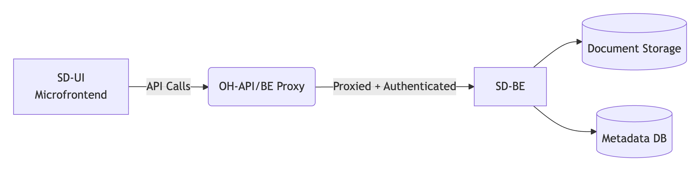

# Smart Doc Backend (SD-BE)

## Overview

**SD-BE** is the backend service for the **Smart Doc** module of Open Hospital — a digital patient documentation system designed to catalog and store medical documents in a structured and secure manner.

This service operates as part of the new **pluggable micro frontend architecture** for Open Hospital, where it provides specialized document management APIs while leveraging the existing OH-API/BE for authentication, authorization, and core hospital data proxying.

## Key Responsibilities

- Manage digital patient documents (upload, storage, metadata, retrieval)

- Provide RESTful APIs for the **Smart Doc UI (SD-UI)** micro frontend

- Integrate with the existing **OH-API/BE**, which acts as a proxy and gateway for authentication and permission enforcement

- Follow Open Hospital's domain and security standards

## Technology Stack

- **Java 25** - Latest Java LTS with modern language features
- **Spring Boot 4.0.2** - Enterprise application framework
- **Spring Web MVC** - RESTful web services
- **Spring Security** - Stateless JWT-based authentication
- **Spring Data JPA** - Data access and persistence
- **Gradle (Kotlin DSL)** - Build automation and dependency management
- **OpenAPI 3.1** - API-first design with code generation
- **MapStruct 1.6.3** - Type-safe DTO mapping
- **Lombok** - Boilerplate code reduction
- **JUnit 5** - Testing framework
- **WireMock** - API mocking for integration tests

## Architecture Context



1. SD-BE is **not directly exposed** to the frontend. All communication from SD-UI is routed through the main **OH-API/BE**, which:

2. Validates authentication (JWT/session)

3. Checks user permissions

4. Proxies authorized requests to SD-BE

5. Returns the response to SD-UI

This ensures consistency with Open Hospital's existing security and access control patterns.

## Project Structure

```
smart-doc-api/
├── src/
│   ├── main/
│   │   ├── java/org/openhospital/smartdoc/
│   │   │   ├── SmartdocApplication.java         # Spring Boot main class
│   │   │   ├── config/                          # Configuration classes
│   │   │   │   └── SecurityConfig.java          # Security configuration
│   │   │   ├── controller/                      # REST controllers (implements OpenAPI interfaces)
│   │   │   ├── service/                         # Business logic layer
│   │   │   ├── repository/                      # Data access layer
│   │   │   ├── model/                           # Domain entities
│   │   │   ├── dto/                             # Data transfer objects
│   │   │   └── mapper/                          # MapStruct mappers
│   │   ├── openapi/                             # OpenAPI specification (API-first)
│   │   │   ├── openapi.yaml                     # Main API specification
│   │   │   ├── paths/                           # Endpoint definitions
│   │   │   │   ├── documents.yaml               # Document endpoints
│   │   │   │   ├── documents_{id}.yaml          # Single document operations
│   │   │   │   ├── persons.yaml                 # Person search endpoints
│   │   │   │   └── document-types.yaml          # Document type metadata
│   │   │   └── components/                      # Reusable API components
│   │   │       ├── schemas/                     # Data models
│   │   │       │   ├── Document.yaml            # Document schema
│   │   │       │   ├── Problem.yaml             # RFC 7807 error schema
│   │   │       │   └── ...
│   │   │       ├── parameters/                  # Query/path parameters
│   │   │       └── security/                    # Security schemes
│   │   └── resources/
│   │       └── application.properties           # Application configuration
│   └── test/
│       └── java/org/openhospital/smartdoc/     # Test classes
├── build/
│   └── generate-resources/                      # OpenAPI generated code (do not edit)
├── gradle/
│   └── libs.versions.toml                       # Centralized dependency versions
├── build.gradle.kts                             # Gradle build configuration
├── settings.gradle.kts                          # Gradle settings
├── .editorconfig                                # Code style configuration
└── AGENTS.md                                    # Development guide for AI agents
```

## Getting Started

### Prerequisites

- Java 25 or later
- Gradle 9.x (or use included wrapper `./gradlew`)

### Build and Run

```bash
# Build the project
./gradlew build

# Run the application
./gradlew bootRun

# Run tests
./gradlew test

# Generate OpenAPI code
./gradlew openApiGenerate
```

The application will start on `http://localhost:8080` by default.

### OpenAPI Documentation

- **Lint OpenAPI spec:** `./gradlew lint`
- **Bundle OpenAPI spec:** `./gradlew buildSpec`
- **Preview OpenAPI docs:** `./gradlew preview` (opens on port 8086)

## Development Workflow

1. **Define API contracts** in `src/main/openapi/` YAML files
2. **Generate Spring interfaces** with `./gradlew openApiGenerate`
3. **Implement controllers** by implementing generated interfaces
4. **Write business logic** in service layer
5. **Test thoroughly** with JUnit 5 and integration tests
6. **Validate** with `./gradlew check`

## API-First Design

This project follows an **API-first approach** using OpenAPI 3.1:

- API contracts are defined in YAML before implementation
- Spring controller interfaces are auto-generated from OpenAPI specs
- Controllers implement these interfaces for type safety
- Changes to the API require updating the OpenAPI spec first

**Never modify generated code** - it will be overwritten on the next build.

## Contributing

When contributing to this project:

1. Follow the code style defined in `.editorconfig`
2. Write tests for all new features
3. Update OpenAPI specs for API changes
4. Run `./gradlew check` before committing
5. See `AGENTS.md` for detailed development guidelines

