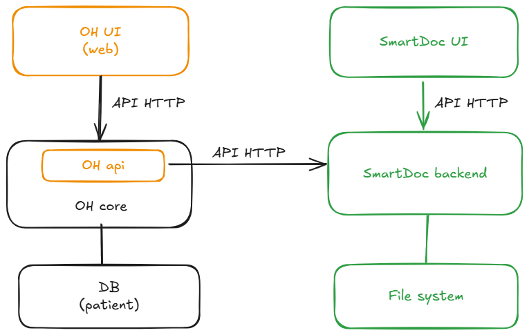
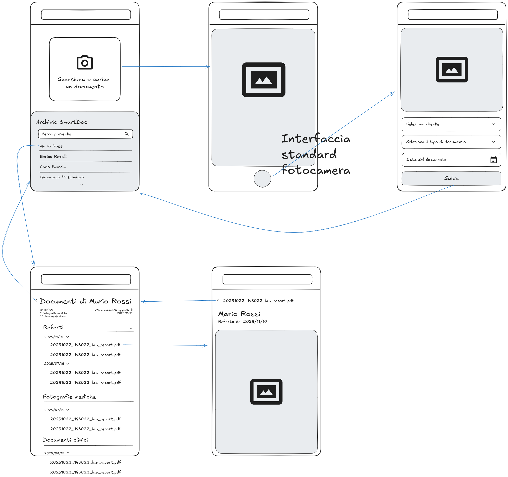

# SmartDoc - Analysis

In this document we describe the 4 main components:

1. **OH-UI** (modifications): Existing OpenHospital Frontend
2. **OH-API** (modifications): Existing Backend serving as proxy/BFF
3. **SmartDoc Server**: New headless application for document management
4. **SmartDoc UI**: New React application for document acquisition

## Component 1: Modifications to OH-UI (OpenHospital Frontend)

### Technologies

- React (existing)
- Integration with existing OH-API

### Required Modifications

#### Laboratory Reports Section

**Consultation (Physician)**

- Display list of reports associated with the patient
- Preview and download documents (jpg and pdf)
- Filters by date/report type
- Integration in the existing reports section

**Insertion (Laboratory Technician)** [PENDING - to be evaluated if really necessary]

- Form for uploading PDF reports
- Associate report to patient

#### Clinical History - Report Documents

- Extension of existing "reports" section
- Display list
- Preview and download documents (jpg and pdf)

#### Clinical History - Documents Section (NEW)

- Display list
- Preview and download documents (jpg and pdf)

#### Surgical Operations - Images (NEW)

- Display list
- Preview and download documents (jpg and pdf)

## Component 2: Modifications to OH-API (OpenHospital Backend)

### Technologies

- Java Spring Boot (existing)
- REST API

### Role: Backend for Frontend (BFF)

OH-API does not manage documents directly but:

- Authenticates and authorizes requests
- Validates user permissions (physician, laboratory technician, nurse)
- Acts as a proxy to SmartDoc Server

## Component 3: SmartDoc Server (New Headless Application)

### Proposed Technologies

- Java / Spring or Node.js
- Native File System (no DB)
- REST API

### Architecture



#### File System Structure

The patient ID (numeric) is:
- normalized to a 6-digit format,
- decomposed into two-digit strings
- and organized in a 3-level folder structure. 
- Within each patient folder, there is a subfolder structure, one for each document type/OH section

#TODO: review folder naming convention
````
/smartdoc-storage/
├── patients/
│   ├── 00/00/01/
│   │   ├── REF/
│   │   │   ├── 20251022_143022_lab_report.pdf
│   │   │   └── 20251021_090000_blood_test.pdf
│   │   ├── DOC/
│   │   │   ├── 20251020_historical_record_001.jpg
│   │   │   └── 20251020_historical_record_002.jpg
│   │   └── MED/
│   │       ├── 20251015_surgery_photo_001.jpg
│   │       └── 20251015_surgery_photo_002.jpg
│   ├── 00/00/02/
│   └── ...
└── 
````

**Explanation:**

- Patient ID `000001` → `/patients/00/00/01/`
- Patient ID `123` → `/patients/00/01/23/`
- Patient ID `123456` → `/patients/12/34/56/`
- Each level contains a maximum of 100 subfolders (00-99)
- Improves performance when listing files on a file system with many patients

**Document Categorization**

- DOC: clinical history - digitalized paper documents
- MED: medical photographs (surgical procedures, casts, hematomas, diagnostic phases, etc.) [new OH section]
- REF: laboratory reports (presumably uploaded in pdf format by the laboratory technician via integration with the OH interface)

#### Naming Convention

**Format**: `YYYYMMDD_HHmmss_{description}_{progressive}.{ext}`

- Timestamp for natural sorting
- Optional description
- Progressive number to avoid collisions
- Original extension preserved (jpg or pdf)

### Functionality

SmartDoc Server is completely headless and communicates with connected systems via HTTP API.

The connected systems are:

- OH or another client, for consulting the document archive
- SmartDoc UI for digitalization

#### Terminology

- **Client**: identifies the client/patient. A generic naming was chosen to emphasize that the tool is independent from OH. In SmartDoc, the client is uniquely identified by the `clientID` (6-digit numeric code). 

> Via API, SmartDoc can retrieve a label (presumably name-surname) to simplify patient identification. The association with OH data is `ClientID - PatientID`.  
**This function is optional and applies only when SmartDoc is integrated into OH.**

#### API for consultation client (OH)

- `GET /api/documents?clientId={code}&type={type}&page={pageNumber}&fromDate={fromDate}&toDate={toDate}`
  - optional:
    - `pageNumber`
    - `fromDate`
    - `toDate`
- `GET /api/documents/{documentId}`
- `POST /api/documents?clientId={code}&type={type}&date={documentDate}` - (for uploading new documents, where applicable)

#### API for SmartDoc UI

- `GET /api/clients;` `GET /api/clients?name={partial-name}`  (also used by the interface autocomplete)
- `GET /api/clients/{clientId}` - if available, retrieves patient names
- `GET /api/document-types` - returns supported document types (**DOC; MED; REF** #TODO), necessary to populate the select in the interface and categorize the scanned document
- `GET /api/documents?clientId={code}&type={type}&page={pageNumber}&fromDate={fromDate}&toDate={toDate}`
  - optional:
    - `pageNumber`
    - `fromDate`
    - `toDate`
- `POST /api/documents?clientId={code}&type={type}&date={documentDate}`
- `PUT /api/documents?clientId={code}&type={type}&date={documentDate}`
- `DELETE /api/documents/{documentId}`

## Component 4: SmartDoc UI (Mobile React Application)

### Functionality

- Upload documents (images and PDFs) from cameras or via file upload
- Document categorization (DOC, MED, REF #TODO)

### Operating Modes

#### Stand-Alone Mode

  - Manual entry of patient code (0-999999)
  - No online validation
  - Direct upload to SmartDoc Server

#### OH Mode (Online)

  - Patient validation via OH-API
  - Shows patient name for confirmation
  - Upload via OH-API (with authentication)

### UI


